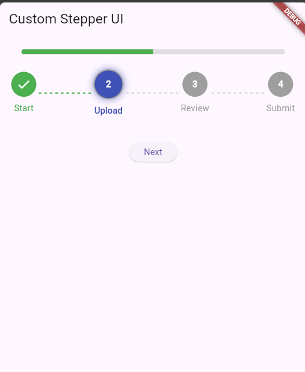
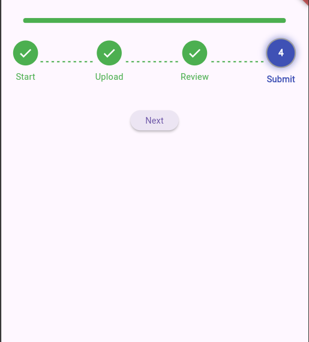
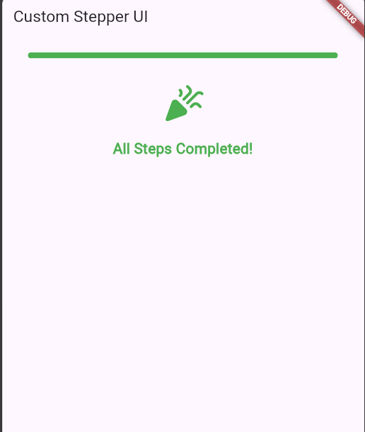

# Custom Stepper

A customizable stepper widget for Flutter with animated step indicators, progress bar, and dotted connectors. Perfect for building multi-step forms, onboarding processes, or wizard-style UIs.

## Features

- Animated step circles that grow when active.
- Smooth transition in progress bar as steps are completed.
- Dotted connectors between steps for visual flow.
- Fully customizable colors for active, completed, and inactive steps.
- Celebration message with an animated icon when all steps are completed.

## Installation

Add `custom_stepper` as a dependency in your `pubspec.yaml`:

```yaml
dependencies:
  custom_stepper: ^1.0.0
```

## Usage

Import the package and use `CustomStepper` in your app:

```dart
import 'package:flutter/material.dart';
import 'package:custom_stepper/custom_stepper.dart';

void main() {
  runApp(MyApp());
}

class MyApp extends StatelessWidget {
  @override
  Widget build(BuildContext context) {
    return MaterialApp(
      home: Scaffold(
        body: Padding(
          padding: const EdgeInsets.all(16.0),
          child: CustomStepper(
            currentStep: 2, // Current step index
            steps: ['Step 1', 'Step 2', 'Step 3', 'Step 4'],
            onStepTapped: (index) {
              print('Tapped on step $index');
            },
          ),
        ),
      ),
    );
  }
}
```

## Parameters

| Parameter          | Type                  | Description                                                     |
|--------------------|-----------------------|-----------------------------------------------------------------|
| `currentStep`      | `int`                 | The index of the current step.                                  |
| `steps`            | `List<String>`        | List of step titles or descriptions.                           |
| `onStepTapped`     | `Function(int)?`       | Callback when a step is tapped.                                |
| `activeColor`      | `Color`               | Color of the active step circle.                               |
| `completedColor`   | `Color`               | Color of the completed step circle.                            |
| `inactiveColor`    | `Color`               | Color of the inactive step circle and progress bar.            |

## Example

```dart
CustomStepper(
  currentStep: 2,
  steps: ['Step 1', 'Step 2', 'Step 3', 'Step 4'],
  activeColor: Colors.blue,
  completedColor: Colors.green,
  inactiveColor: Colors.grey,
  onStepTapped: (index) {
    // Handle step tap
  },
)
```

## Screenshots





## Changelog

### 1.0.0
- Initial release.

## License

This package is under the [MIT License](LICENSE).
