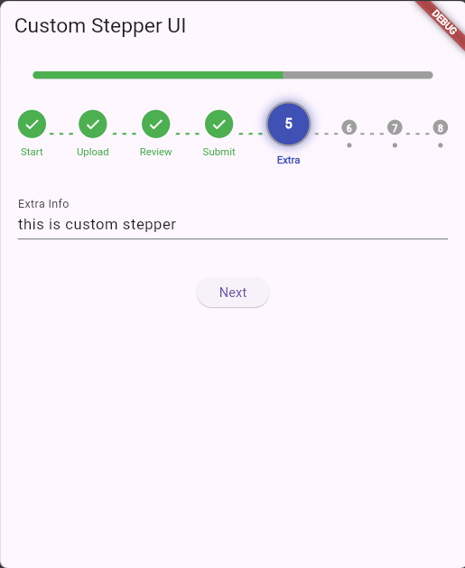
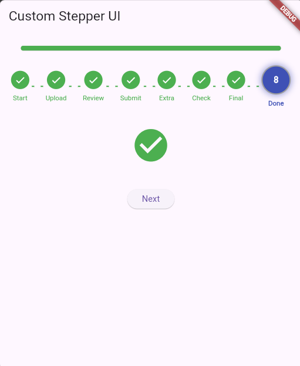
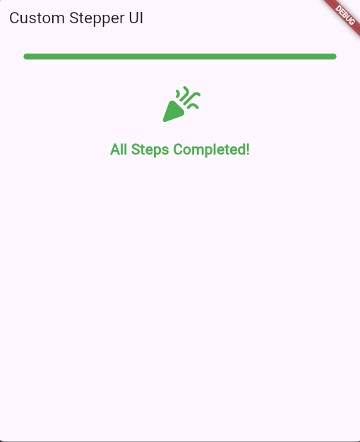
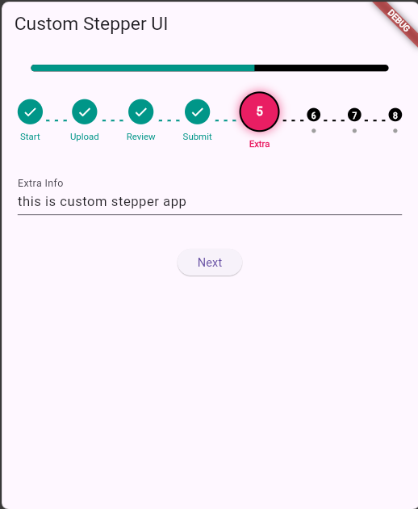
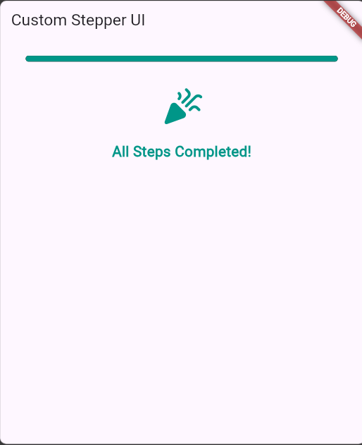

# Custom Stepper

A customizable stepper widget for Flutter with animated step indicators, progress bar, dotted connectors, and customizable step validation. Perfect for building multi-step forms, onboarding processes, or wizard-style UIs, with added features like customizable step colors.

## Features

- Animated step circles that grow when active.
- Smooth transition in the progress bar as steps are completed.
- Dotted connectors between steps for visual flow.
- Fully customizable colors for active, completed, and inactive steps.
- Celebration message with an animated icon when all steps are completed.

## Installation

Add `custom_stepper` as a dependency in your `pubspec.yaml`:

```yaml
dependencies:
  custom_stepper: ^1.1.0
```

## Usage

Import the package and use `CustomStepper` in your app:

```dart
import 'package:flutter/material.dart';
import 'package:custom_stepper/custom_stepper.dart';

void main() => runApp(const MyApp());

class MyApp extends StatefulWidget {
  const MyApp({super.key});
  @override
  State<MyApp> createState() => _MyAppState();
}

class _MyAppState extends State<MyApp> {
  int currentStep = 0;
  final steps = ['Start', 'Upload', 'Review', 'Submit', 'Extra', 'Check', 'Final', 'Done'];

  void _nextStep() {
    setState(() {
      currentStep = currentStep + 1;
    });
  }

  Widget _getStepContent(int step) {
    switch (step) {
      case 0:
        return const TextField(decoration: InputDecoration(labelText: 'Enter your name'));
      case 1:
        return ElevatedButton(onPressed: () {}, child: const Text('Upload File'));
      case 2:
        return const Text('Review your details here...');
      case 3:
        return const Text('Submit when ready.');
      case 4:
        return const TextField(decoration: InputDecoration(labelText: 'Extra Info'));
      case 5:
        return CheckboxListTile(
          title: const Text('Agree to terms'),
          value: true,
          onChanged: (_) {},
        );
      case 6:
        return const Text('Almost done...');
      case 7:
        return const Icon(Icons.check_circle, color: Colors.green, size: 64);
      default:
        return const SizedBox.shrink();
    }
  }

  @override
  Widget build(BuildContext context) {
    return MaterialApp(
      title: 'Stepper Demo',
      home: Scaffold(
        appBar: AppBar(title: const Text('Custom Stepper UI')),
        body: SingleChildScrollView(
          padding: const EdgeInsets.all(20.0),
          child: Column(
            children: [
              CustomStepper(
                currentStep: currentStep,
                steps: steps,
                onStepTapped: (index) => setState(() => currentStep = index),
                colorSet: [Colors.pink, Colors.teal, Colors.black],
              ),
              const SizedBox(height: 30),
              _getStepContent(currentStep),
              const SizedBox(height: 40),
              if (currentStep < steps.length)
                ElevatedButton(
                  onPressed: _nextStep,
                  child: const Text('Next'),
                ),
            ],
          ),
        ),
      ),
    );
  }
}
```

## Parameters

| Parameter            | Type                  | Description                                                     |
|----------------------|-----------------------|-----------------------------------------------------------------|
| `currentStep`        | `int`                 | The index of the current step.                                  |
| `steps`              | `List<String>`        | List of step titles or descriptions.                           |
| `onStepTapped`       | `Function(int)?`       | Callback when a step is tapped.                                |
| `colorSet[0]`        | `Color`               | Color of the active step circle.                               |
| `colorSet[1]`        | `Color`               | Color of the completed step circle.                            |
| `colorSet[2]`        | `Color`               | Color of the inactive step circle and progress bar.            |


## Screenshots
### default colors



### customized colors



## Changelog

### 1.0.0
- added color customization for active, completed, and inactive steps.
- introduced customizable colorSet for flexible color options.

### 0.0.1
- Initial release.

## License

This package is under the [MIT License](LICENSE).
